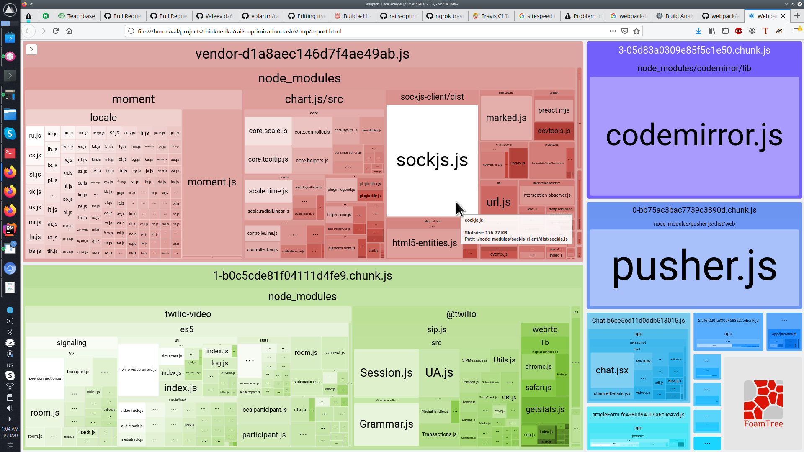
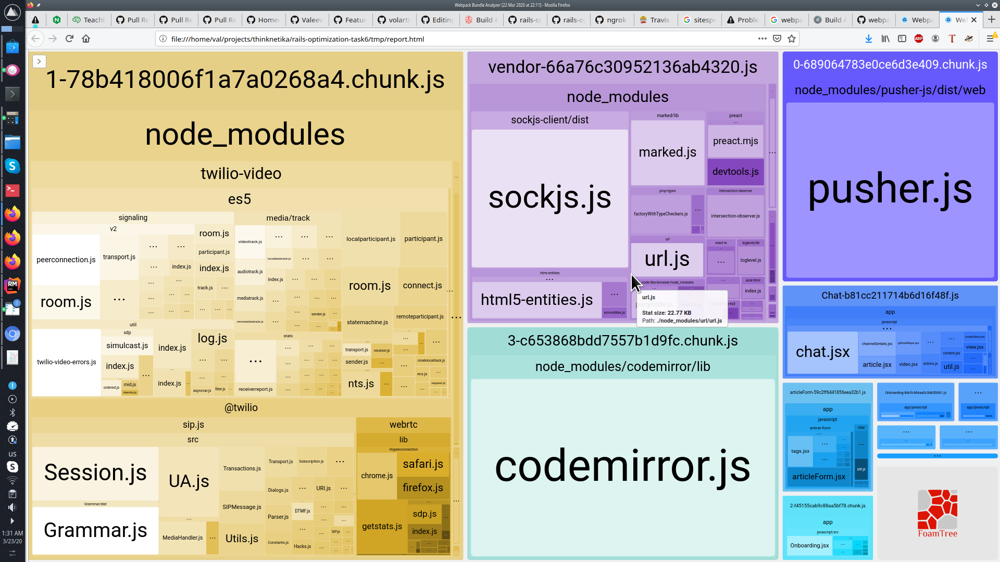

# Задание №6

### Что было сделано?

1. Подключил trevis.ci.
2. Закоментил спеки, что бы билд проходил.
3. После того как билд проешл успешно. Добавил тест с sitespeed.io c ссылкой на локальный проект через ngrok, добился запуска и для начала без оптимизации `red test`
4. Установил бюджет, которого требуется достичь.
5. Убедился, что метрика собирается.
6. Подключил git actions
7. закомментил `app/javascript/packs/proCharts.js`, проанализировал analyzer-ом еще раз.
8. убедился, что теперь билд проходит на иревисе и в git action.
9. Нашел интересный ресур с описанием других утилит для webpacker-а для анализа - https://survivejs.com/webpack/optimizing/build-analysis/
10. Отметил для себя разобраться с ними и повысить скилы по фронту.

До оптимизации.

После того, как закомментировал `app/javascript/packs/proCharts.js`

