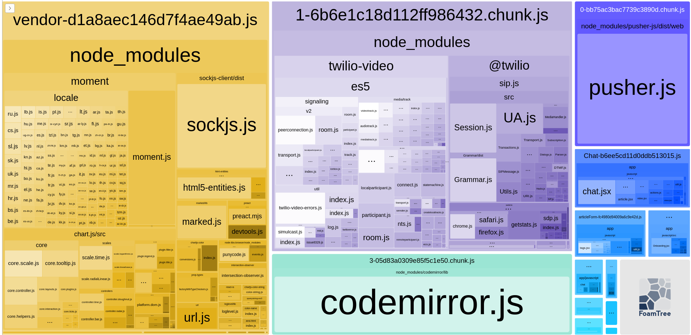
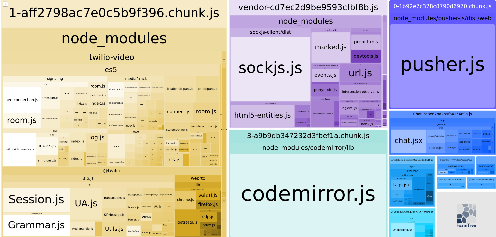

# Case Study

## Шаг 1. Бюджет

Задал бюджет на объём js на главной странице.

Прогнал sitespeed
`npm i -g sitespeed.io && sitespeed.io http://localhost:3000 --budget.configPath homeBudget.json`

Бюджет не соблюдается:
`INFO: Failing budget JavaScript Transfer Size for http://localhost:3000 with value 3.6 MB max limit 449.2 KB`

## Шаг 2. Оптимизация

Добавил плагин webpack-bundle-analyzer

Выполните анализ исходной версии приложения с помощью webpack-bundle-analyzer

moment.js входит в сборку vendor

Закомментировал всё содержимое файла proCharts.js
Бандл похудел

Но бюджет всё ещё не соблюдается

`Failing budget JavaScript Transfer Size for http://localhost:3000 with value 521.4 KB max limit 449.2 KB`

Скорее всего со времен создания репозитория с заданием имеющиеся либы распухли сами по себе, увеличил бюджет до 540000

## Шаг 3. Настройка CI

Настроил ngrok на прослушивание 3000 порта и запустил приложение
Настроил Github Actions на запуск проверки sitespeed на публичном урле запущенного приложения

Проверка пройдена успешно
`INFO: Budget: 1 working, 0 failing tests and 0 errors`
