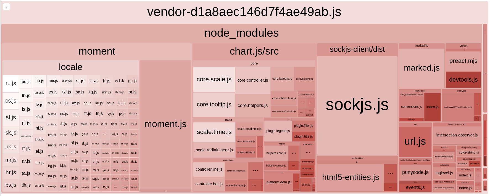
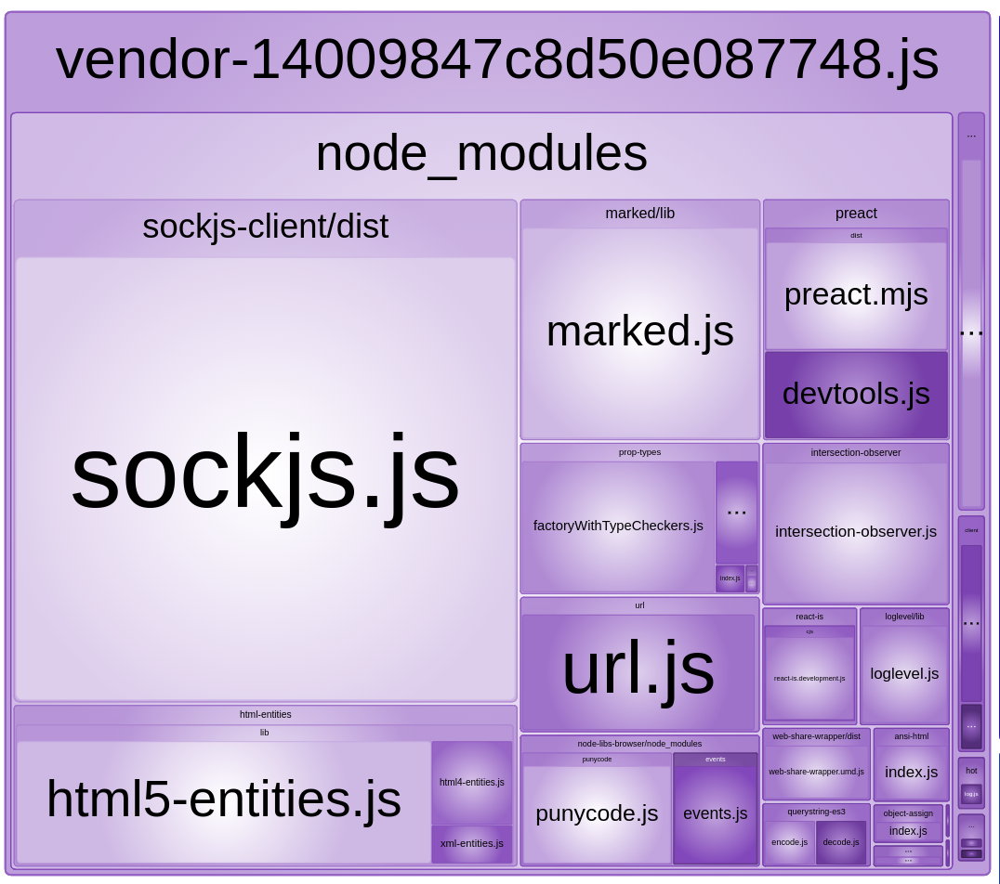
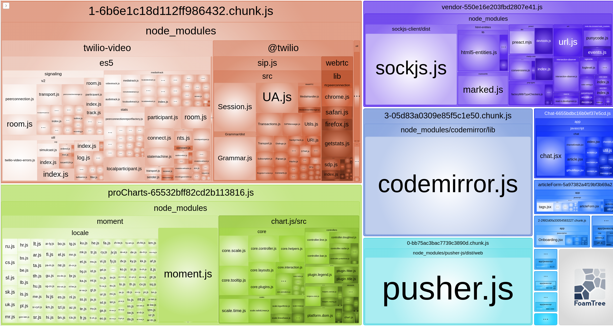

## Бюджет

```
sitespeed.io http://localhost:3000/ -n 1 --budget.configPath homeBudget.json

Failing budget JavaScript Transfer Size for http://localhost:3000/ with value 3.2 MB max limit 449.2 KB
```

## Оптимизация

1. Анализ исходной версии:


2.  Анализ изменённой версии(Закомментируйте всё содержимое файла `proCharts.js`):



## Cleanup

- `proCharts.js` подключается в `app/views/dashboards/pro.html.erb` отдельным pack-ом, поэтому исключаем moment.js и chart.js из vendor


## Защита от деградации

```
sitespeed.io http://localhost:3000/ -n 1 --budget.configPath homeBudget.json

Failing budget JavaScript Transfer Size for http://localhost:3000 with value 634.0 KB max limit 449.2 KB
```

- В бюджет не уложились, видно другие пакеты стали тяжелее, поэтому повышаем бюджет до 650 KB


## Настройка CI


