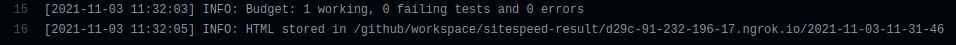

## Проблема

Загружаемый файл vendor.js весит слишком много и используется далеко не везде - неоптимально

## Бюджет

В качестве бюджет выбран размер 460000 байт (взят из файла с бюджетом)

### Step 1

Запустил sitespeed.io, бюджет не соблюдается:

```
docker run --privileged --rm --net=host -v "$(pwd)":/sitespeed.io sitespeedio/sitespeed.io -n 1 http://localhost:3000/ --budget.configPath homeBudget.json
```

Результат

```
[2021-11-02 13:31:17] INFO: Budget: 0 working, 1 failing tests and 0 errors
[2021-11-02 13:31:19] INFO: HTML stored in /sitespeed.io/sitespeed-result/localhost/2021-11-02-13-30-55
```

### Step 2

Построил отчет webpack-bundle-analyzer, который показал, что moment.js входит в vendor


### Step 3

Закомментировал внутрянку proCharts.js, moment.js больше не входит в vendor


### Step 4

- `proCharts.js` используется в `app/views/dashboars/pro.html.erb`
- Добавил `moment.js` и `chart.js` в исключения сборки вебпака через `CommonsChunkPlugin`

```
[2021-11-03 11:12:23] INFO: Failing budget JavaScript Transfer Size for http://localhost:3000/ with value 537.2 KB max limit 468.8 KB
```

Уж не знаю, что стало с размером либ, но в поставленный бюджет не уложиться по заданию, увеличил бюджет до 560кб

```
[2021-11-03 11:14:23] INFO: Budget: 1 working, 0 failing tests and 0 errors
```

### Step 5

- Установил `ngrok`
- Создал конфиг для `Githab Action`
- Запушил изменения
- Все прошло успешно


