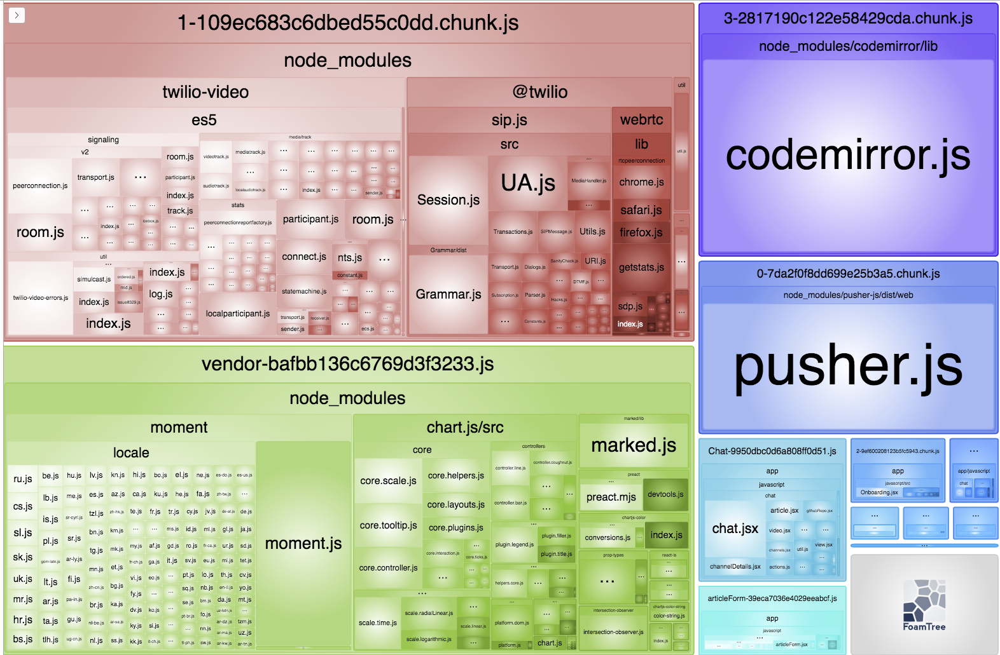
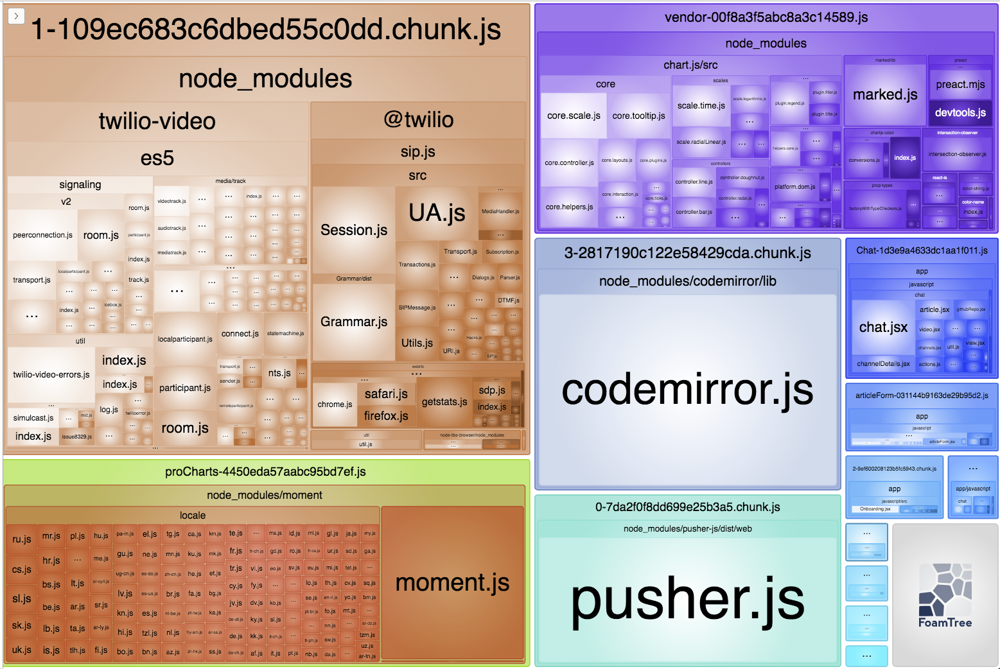
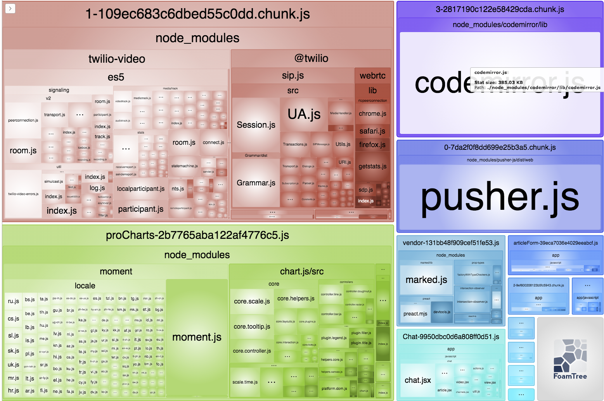
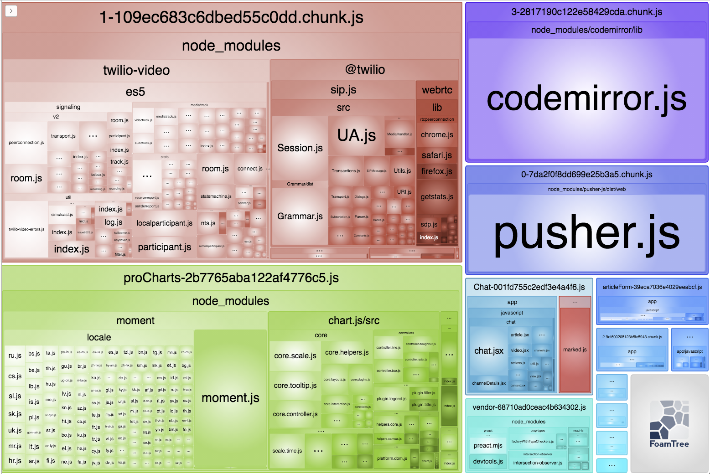

# Задание 6-й недели

## 1. Эксперимент с `proCharts.js`

### 1.1. Изначально бюджет не соблюдается

```
[2021-05-26 17:08:28] INFO: Failing budget JavaScript Transfer Size
  for http://host.docker.internal:3000/ with value 3.2 MB max limit 449.2 KB
[2021-05-26 17:08:28] INFO: Budget: 0 working, 1 failing tests and 0 errors
```

### 1.2. При исключении `proCharts.js` видно приближение к бюджету

Но, пока что, бюджет не соблюдается:

```
[2021-05-26 17:14:28] INFO: Failing budget JavaScript Transfer Size
  for http://host.docker.internal:3000/ with value 521.5 KB max limit 449.2 KB
[2021-05-26 17:14:28] INFO: Budget: 0 working, 1 failing tests and 0 errors
```

Можно предположить, что только исключения `proCharts.js` недостаточно, чтобы его
достичь, однако, направление верное. Попробуем отработать бюджет на стадии
анализа упаковки и перемещения компонентов.

## 2. Оптимизация упаковки

### 2.1. Вынос `moment`

В графе `webpack-bundle-analyzer`-а хорошо видно `moment.js` и его локали в `vendor`:



Комментируем загрузку `chart.js` прямо в `proChart.js` и он исчезает в выводе
анализатора. Следовательно, он нужен только в `proChars.js`.

Теперь смотрим, где нужен `proCharts.js`. Он подключается в
`app/views/dashboards/pro.html.erb`. Причем, уже подключается через отдельный пак,
однако, попадает в общую сборку из-за своего расположения.

В рамках задачи применим не совсем изящное его исключение из общего пака
условием в `environment.js` выносим `moment`, он объединяет `moment.js` и
локали.

Убеждаемся, что `moment` отделился:



Бюждет ожидаемо не достигнут:

```
[2021-06-20 09:11:47] INFO: Failing budget JavaScript Transfer Size
  for http://host.docker.internal:3000/ with value 1.6 MB max limit 449.2 KB
[2021-06-20 09:11:47] INFO: Budget: 0 working, 1 failing tests and 0 errors
```

### 2.2. Вынос `chart.js` и сопуствующих компонентов

Видно, что в общем паке присутствует сам `chart.js`, поэтому выносим его.

Успешно выносится, но бюджет пока еще не доходит даже до значения,
измеренного при полном отключении `proCharts.js`:

```
[2021-06-20 09:16:14] INFO: Failing budget JavaScript Transfer Size
  for http://host.docker.internal:3000/ with value 634.0 KB max limit 449.2 KB
[2021-06-20 09:16:14] INFO: Budget: 0 working, 1 failing tests and 0 errors
```

Анализируем зависимости, находим, что так же можно вынести `chartjs-color` и
`color-name`. Вот, что получается в итоге:



И по бюджету:

```
[2021-06-20 09:24:45] INFO: Failing budget JavaScript Transfer Size
  for http://host.docker.internal:3000/ with value 523.9 KB max limit 449.2 KB
[2021-06-20 09:24:45] INFO: Budget: 0 working, 1 failing tests and 0 errors
```

Удалось достигнуть значения, замеренного в начале. Разница незначительна,
и возникает либо из-за другой перепаковки компонентов, либо из-за
незначительного изменения версий. Не будем искать эти 2.4 кб,
попытаемся далее все-таки достичь бюджета засчет перемещения других компонентов.

### 2.3. Достижение бюджета

Анализируя оставшиеся в `vendor` компоненты находим, что совершенно безболезненно
можно вынести аналогичным уже проделанному образом `marked/lib`. Он нужен только
в чате, подключается в `app/javascript/chat/githubRepo.jsx`, который, так же как
это было с `proCharts.js` уже имеет свой пак и подключается явно в
`app/views/chat_channels/index.html.erb`.

Выносим его, убеждаемся, что он не отделился в отдельный пак, а стал частью
пака `chat.js`:



...и достигаем бюджета:

```
[2021-06-20 09:41:55] INFO: Budget: 1 working, 0 failing tests and 0 errors
```

К слову, в итоге получилось `410.9` кб.
