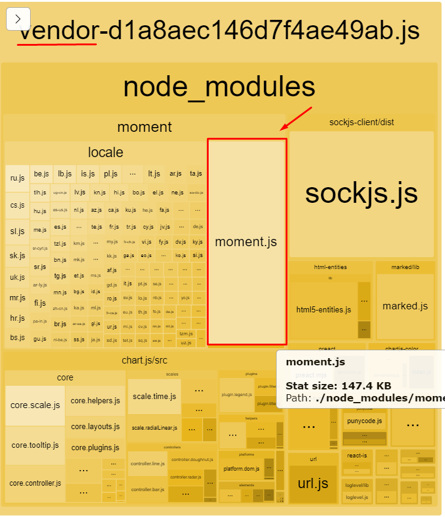
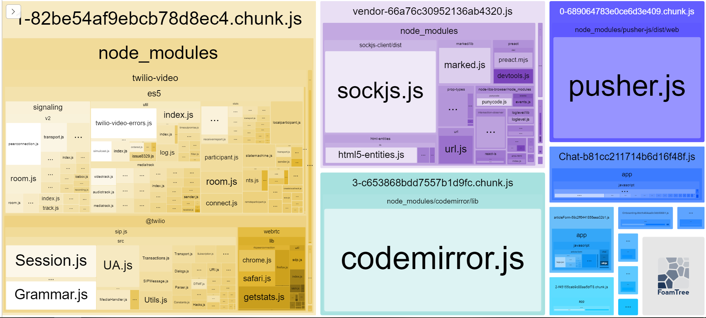
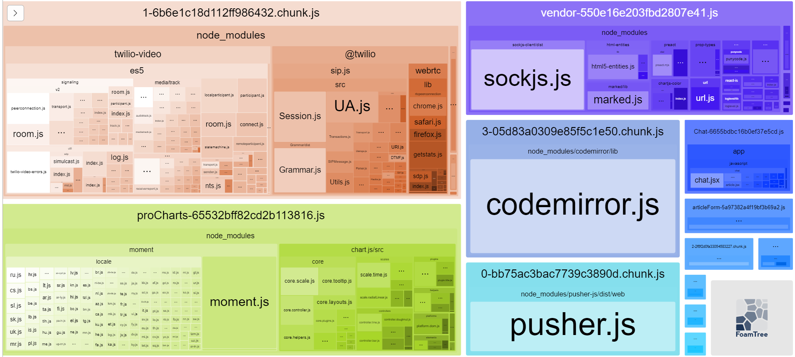
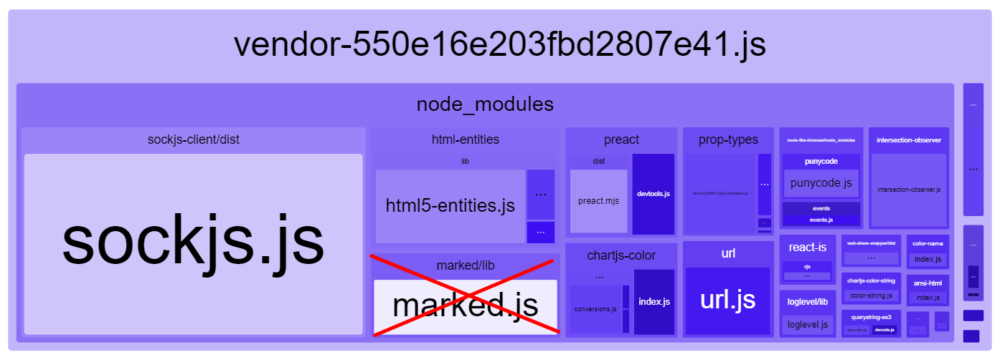
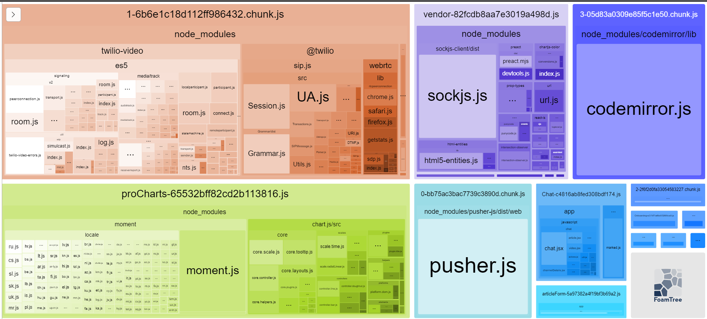

# Задание №6

## Оптимизация загрузки js на dev.to и настройка `CI`

На всех страницах `dev.to` загружается файл `vendor.js`.

Анализ показывает, что этот файл содержит библиотеку `moment.js`, печально известную своим большим размером.

## Бюджет

Начал с того, что задался бюджетом на объём `js` на главной странице.

Создал бюджет для `sitespeed.io` Для этого добавил файл `homeBudget.json` в корень проекта со след. содержанием:

```json
{
  "budget": {
    "transferSize": {
      "javascript": 460000
    }
  }
}
```

Введя команду

```bash
docker run --privileged --rm -v "$(pwd)":/sitespeed.io sitespeedio/sitespeed.io http://host.docker.internal:3000/ -n 1 --budget.configPath homeBudget.json
```

убедился, что бюджет пока не соблюдается:

```bash
[2021-09-17 17:49:22] INFO: Failing budget JavaScript Transfer Size for http://host.docker.internal:3000/ with value 1.0 MB max limit 449.2 KB
[2021-09-17 17:49:22] INFO: Budget: 0 working, 1 failing tests and 0 errors
```

## Идея оптимизации

- Включил в процесс сборки `webpack` плагин `webpack-bundle-analyzer`
- Выполнил анализ исходной версии приложения с помощью `webpack-bundle-analyzer`
- Убедился, что `moment.js` входит в сборку `vendor`
  

- Закомментировал все содержимое файла `proCharts.js`
- Выполнил анализ изменённой версии в `webpack-bundle-analyzer`, размер значительно уменьшился
- Сборка выглядит так
  

## Cleanup

Добавил `moment` (+ `chart.js`) в искючения `CommonsChunkPlugin`.
Сам `moment.js` реально используется только в файле `app/views/dashboards/pro.html.erb`, сначала думал после иселючения отдельно руками подключить, но он уже подключается через отдельный пак.

## Итого

### 1

- сборка в `bundle-analyzer` после оптимизации 1
- 

- проверка бюджета не прошла :( совсем немного не хватило

```bash
[2021-09-19 15:31:25] INFO: Failing budget JavaScript Transfer Size for http://host.docker.internal:3000/ with value 476.1 KB max limit 449.2 KB
[2021-09-19 15:31:25] INFO: Budget: 0 working, 1 failing tests and 0 errors
```

### 2

Доп. анализ выявил, что можно добавить в исключения `marked/lib`, который тоже имеет свой пак, а используется только в чате.


- сборка в `bundle-analyzer` после оптимизации 2.
  
- В БЮДЖЕТ УЛОЖИЛСЯ!

```bash
[2021-09-19 16:08:28] INFO: http://host.docker.internal:3000/ 44 requests, TTFB: 4.92s, firstPaint: 5.29s, firstVisualChange: 5.31s, FCP: 5.29s, DOMContentLoaded: 6.22s, LCP: 5.29s, CLS: 0, TBT: 113ms, Load: 6.82s, speedIndex: 5.34s, visualComplete85: 5.47s, lastVisualChange: 5.61s
[2021-09-19 16:08:29] INFO: Budget: 1 working, 0 failing tests and 0 errors
```

## Настройка CI

Теперь настроим `CI`: Интересно попробовать `Github Actions` (с `Travis` уже доводилось работать).

Шаги:

- выставил текущую версию приложения в интернет с помощью `ngrok`
- запушил урл `ngrok` в конфиг `CI` в `github` и тем самым триггернул билд
- билд проверил приложение по урлу `ngrok` с помощью `sitespeed.io` на соблюдение бюджета
- [CI обработал успешно](https://github.com/iL53n/rails-optimization-task6/runs/3645660490)

## Сдача задания

`PR` содержит:

- изменения кода
- описание-casestudy (`case-study.md`)
- скриншоты `bundle-analyzer` до и после оптимизации
- настроенный `CI` на `Github Actions`
