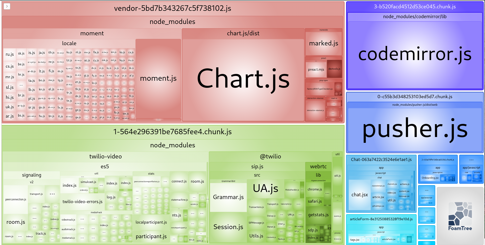
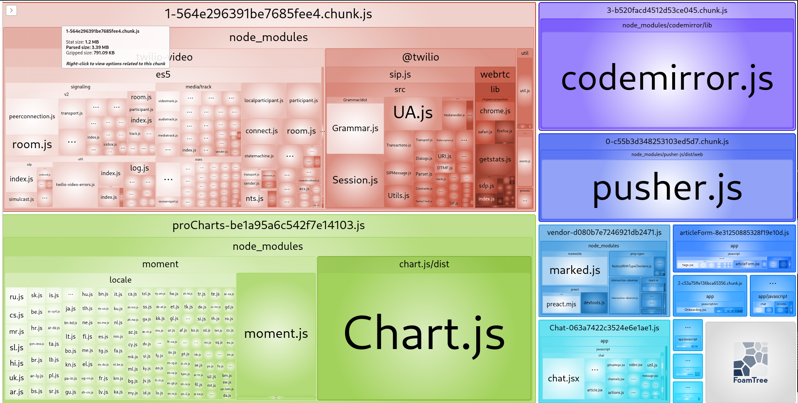

## Проблема
На проекте возникла проблема: объем загружаемого `vendor.js` слишком велик, было решено установить бюджет для `JavaScript` в 550K.

## Подготовка
Настроил бюджет:
```json
{
  "budget": {
    "transferSize": {
      "javascript": 550000
    }
  }
}
```
Далее я запустил `sitespeed.io` и убедился, что бюджет не соблюдается:
```
INFO: Failing budget JavaScript Transfer Size for http://172.17.0.1:3000/ with value 3.6 MB max limit 537.1 KB
INFO: Budget: 0 working, 1 failing tests and 0 errors
```

## Оптимизация

Я подключил `webpack-bundle-analyzer` для детализации объемов используемого `JavaScript` и выяснил, что больше всего потребляют библиотеки `moment.js` и `Chart.js`.



Я исключил библиотеки `moment.js` и `Chart.js` из загрузки в `vendor.js`:



И теперь тест на бюджет проходит успешно:
```
INFO: Budget: 1 working, 0 failing tests and 0 errors
```

## Настройка CI

Для защиты от регрессии я использовал `ngrok` и GitHub Actions:
- [x] Зарегистрировался на ngrok.com.
- [x] Установил `ngrok`, добавил токен.
- [x] Пробросил приложение.
- [x] Создал конфиг Actions.
- [x] Запушил код.
