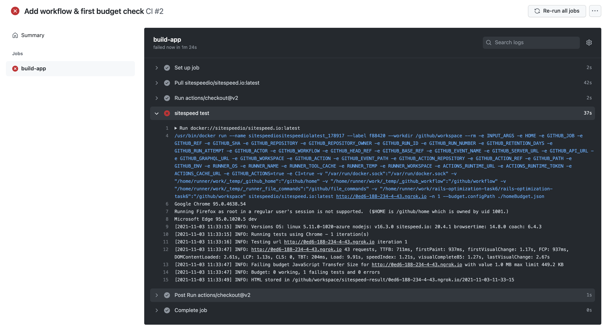
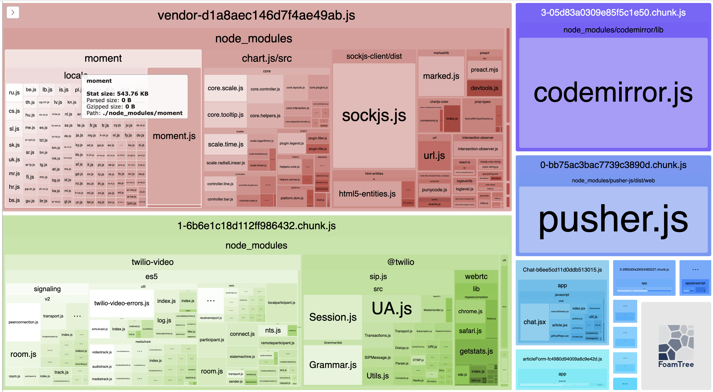

### Подготовка. Развертка проекта

- Использовал наработки предыдущих заданий, единственная возникшая проблемы - израсходовался Algolia key, пришлось завести новый.
- Также в текущем задании была указана версия 2.6.1, а в 4м - 2.6.3 (обновил до 2.6.3)

### Установка бюджета. Первая проверка sitespeed.io

- Установил указанный бюджет (~450KB), собрал github workflow для проверки.
- Первый тест показал что метрика не укладывается в бюджет. Текущее значение: 1.0 MB
  

### Проверка webpack-bundle-analyzer

- Добавил webpack-bundle-analyzer, прогнал проверку. Основная часть vendor - moment.js и chart.js
  
- Закомментировал всё содержимое файла proCharts.js. Объем vendor сократился до 450KB.
