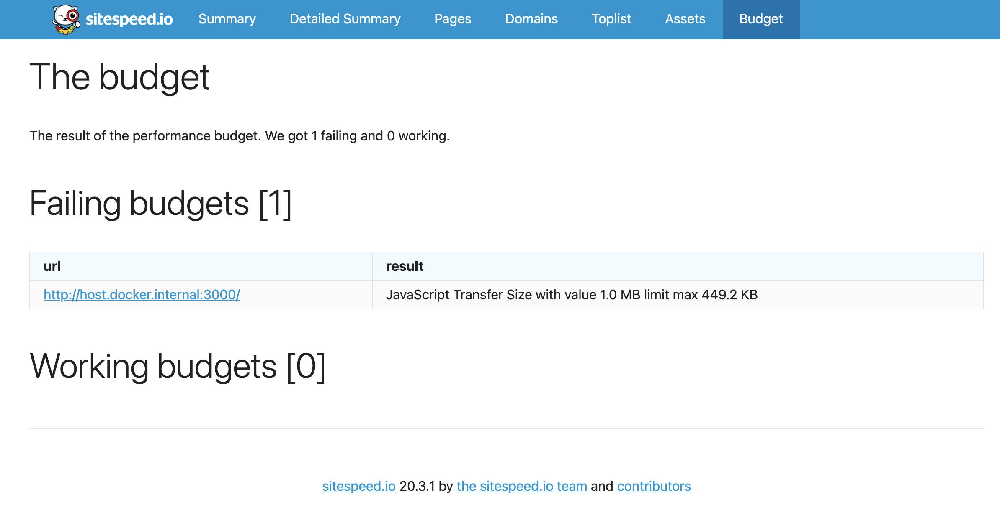
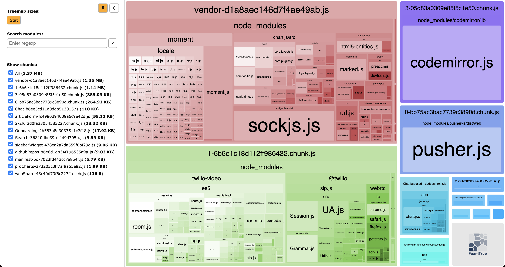
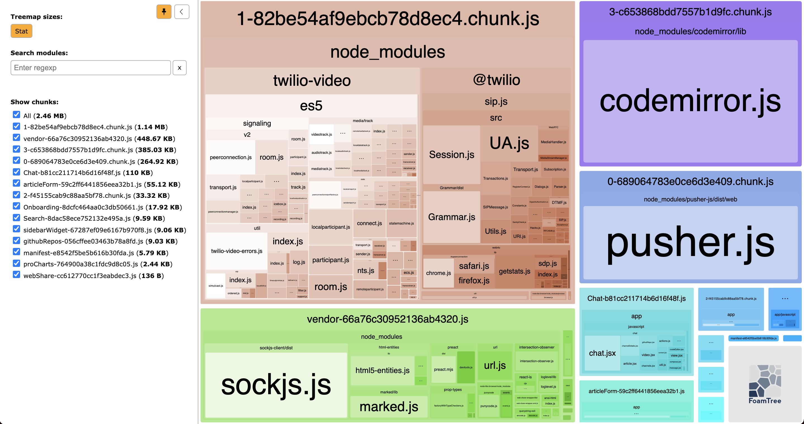
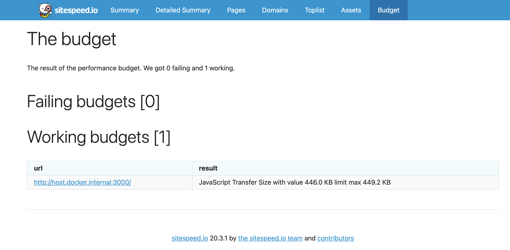
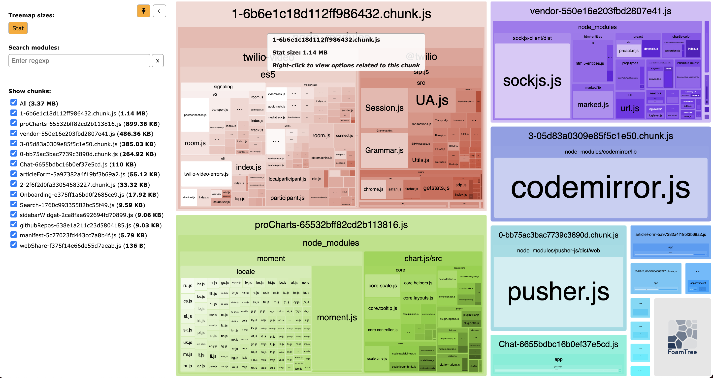

## Первый прогон

- Установил указанный бюджет и запустил проверку спомощью sitespeed.io.
- Результат показал что происходит превышение бюджета в два раза 1.0 MB.
  

## Второй прогон

- Добавил webpack-bundle-analyzer и запустил проверку
  
- Закомментировал всё содержимое файла proCharts.js. Vendor ушол на второй план
  
- Результат уложился в бюджет
  

## Третий прогон

- Добавил moment.js и chart.js в исключения сборки Vendor через `CommonsChunkPlugin`.
  
- Однако, проверка бюджета не совсем проходит. Решил поднять бюджет :)
  

## Настройка CI

- Защитилса от деградации настроив `CI` с помощью `Github Actions`
