## Оптимизация webpack

Установим bundler-webpack-analyze и с помощью sitespeed-тестов будем профилировать и замерять скорость загрузки на главной странице

0) Initial state
   - видим vendor чанк размером 1.35Mb
   - sitespeed-тест не проходит с указанным бюджетом, 1Mb превышает 449Kb бюджета (речь, очевидно, о transfer_size)

  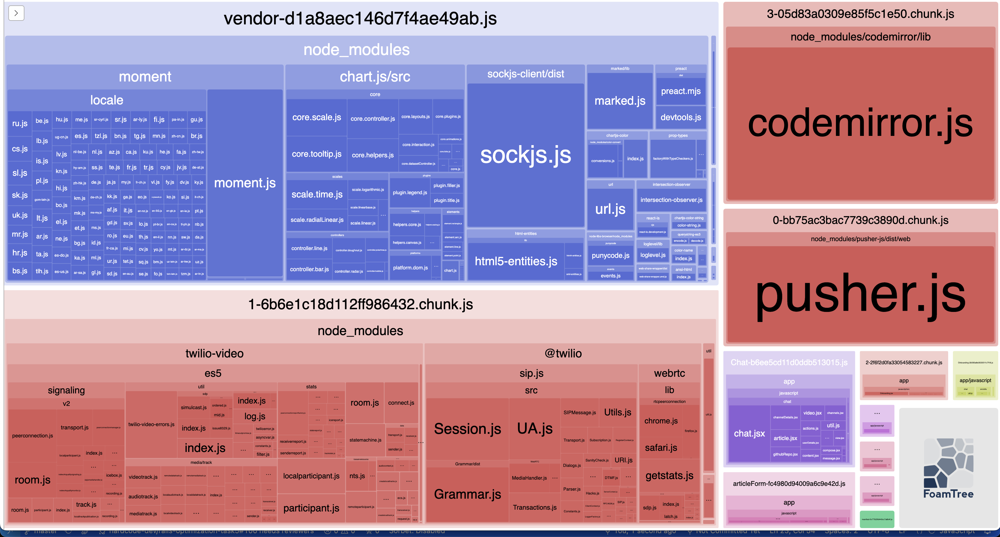
  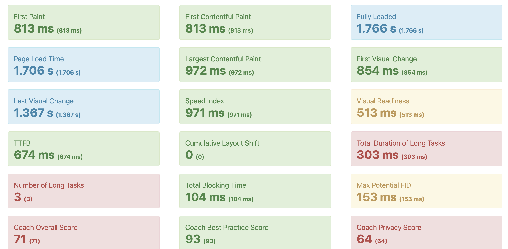

1) Оотключил загрузку momenjs и chart.js из commonchunks
   - vendor-chunk уменьшился в 3 раза (до 486Кб)
   - тест все еще проваливается, хотя превышение составляет меньше 30Кб
   - prochart.js грузит все свои необходимые зависимости в нужный чанк

  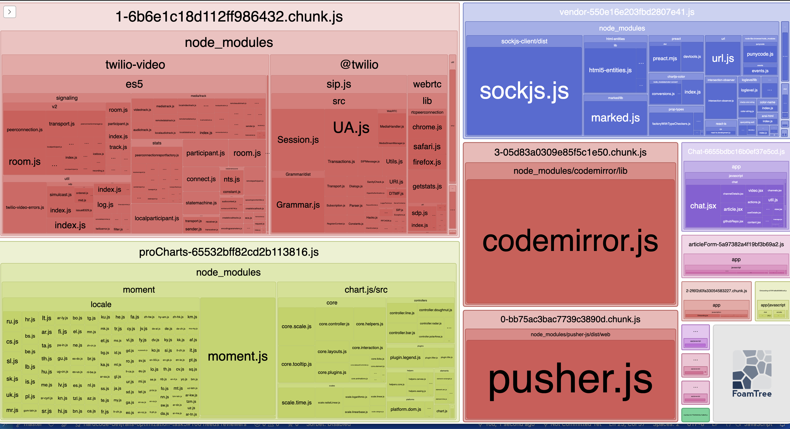
  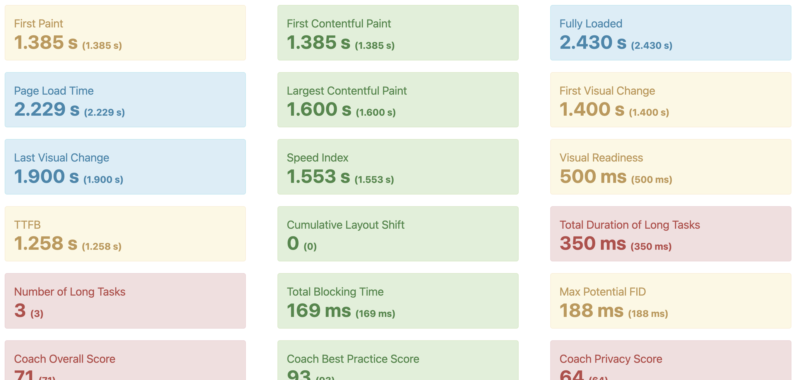

1) Вернул momentjs и chart.js, но отключил загрузку локалей из momentjs
   - vendor-chunk уменьшился в 1.5 раза (до 1Mb) по сравнению с начальным состоянием
   - тест не проходит с двухкратным превышением по объему кода

  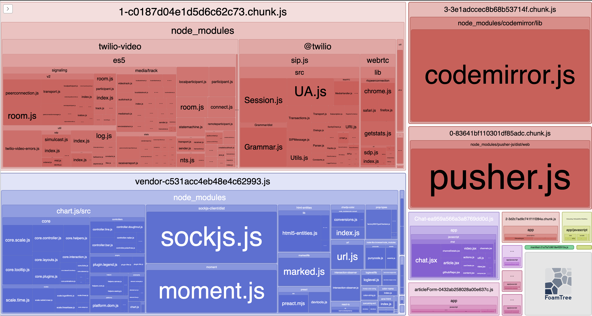
  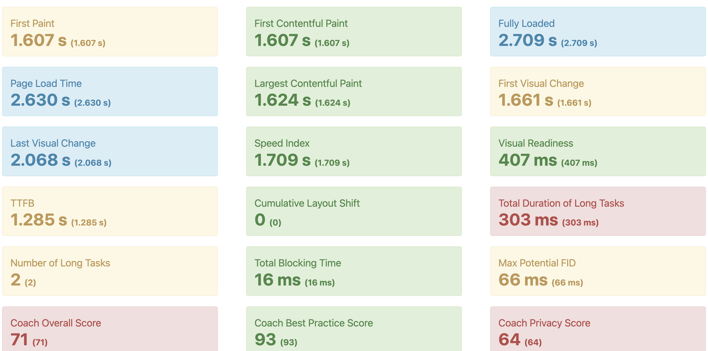

1) Закомментировал procharts.js
   - vendor-chunk уменьшился в 3 раза (до 486Кб)
   - бюджет стал выполняться
   - получили быструю загрузку, но теперь у нас не работают некоторые страницы (pro.html.erb)

  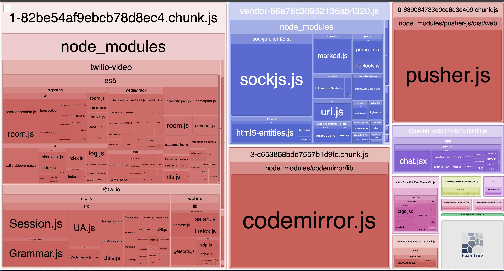
  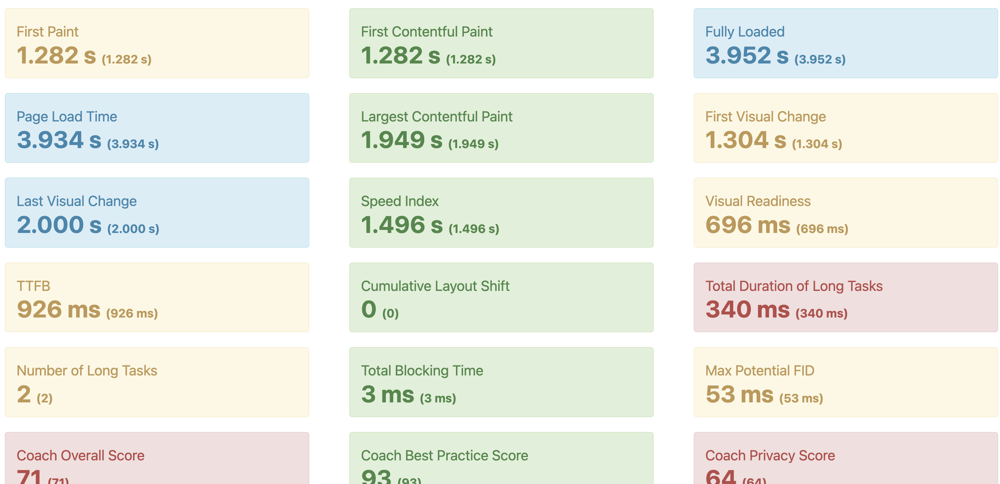

1) Заблокировал создание общих чанков
   - ускорилась загрузка главной
   - скорее всего будет более медленной загрузка других страниц, т.к. придется часто скачивать 1 и тот же код
   - заметили, что socks.js- большая библиотека и требуется практически везде

  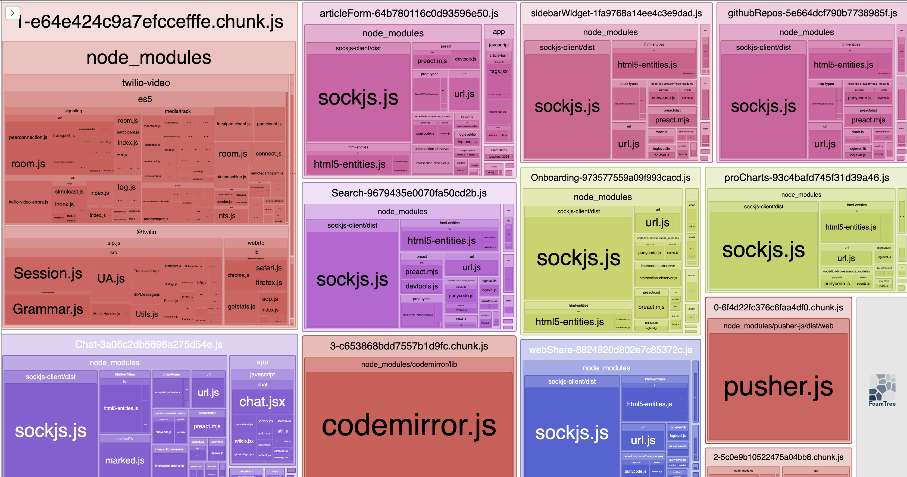
  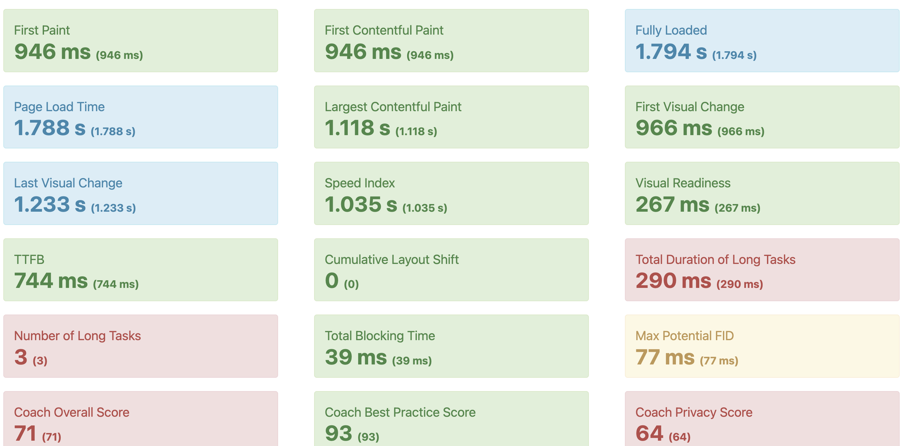

1) Вынес в общий чанк socks.js, отключил локали для momentjs
   - получаем лучший результат по скорости и объему загрузки
   - приходится небольшие библиотеки подгружать в каждом отдельном чанке, но это можно исправить дальнейшими мини-оптимизациями

  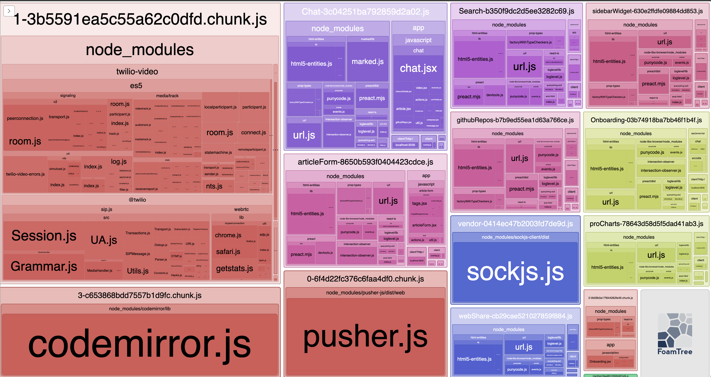
  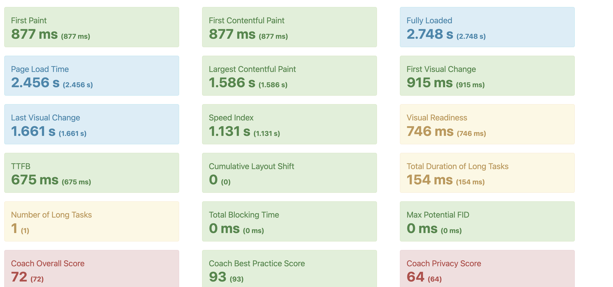

## Настройка travis-ci

