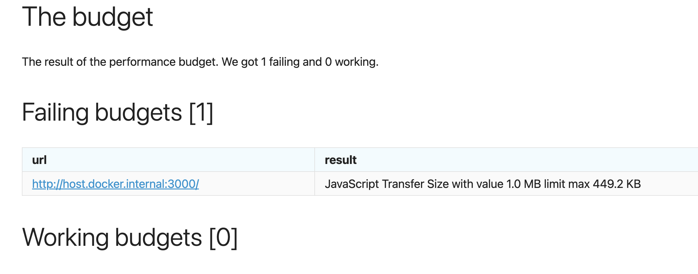
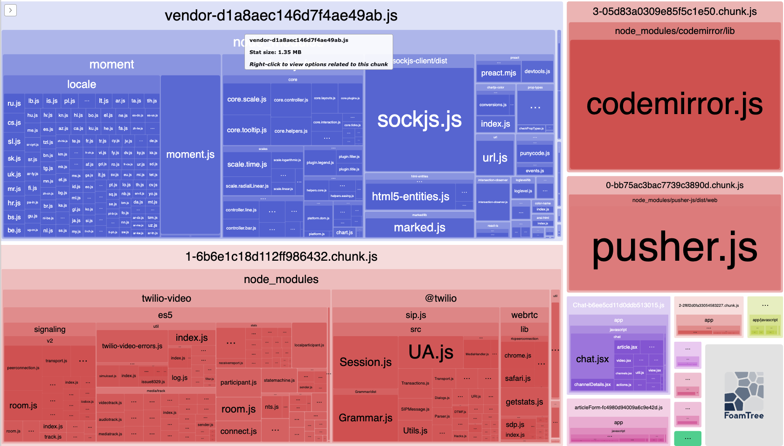
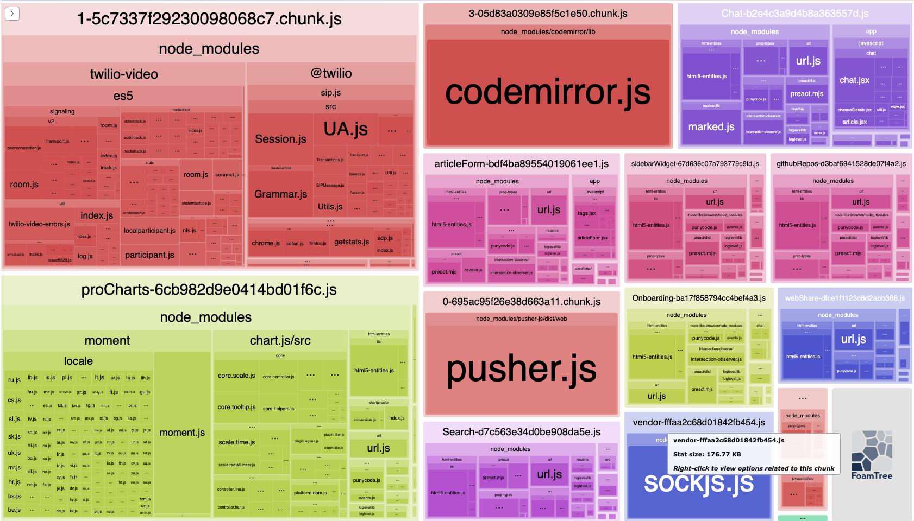
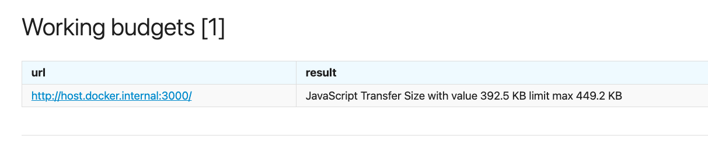

## Оптимизация Webpack

Для оптимизации Webpack была использована библиотека `bundler-webpack-analyze` и sitespeed-тесты на основе рекомендаций из задания.

1. После запуска sitespeed-тестов с заданным бюджетом получил, что размер JavaScript Transfer size превышает заданный бюджет
   
2. `bundler-webpack-analyze` показал, что в `vendor.js` очень большого размера и это основная точка роста
   
3. На основе рекомендаций в задании и на основе других PR подобрал решение, которое уменьшает размер `vendor.js`
   
4. После этого sitespeed-тест c заданным бюджетом уложился в бюджет
   

## Настройка github actions

Настроили CI и добились успешного билда
